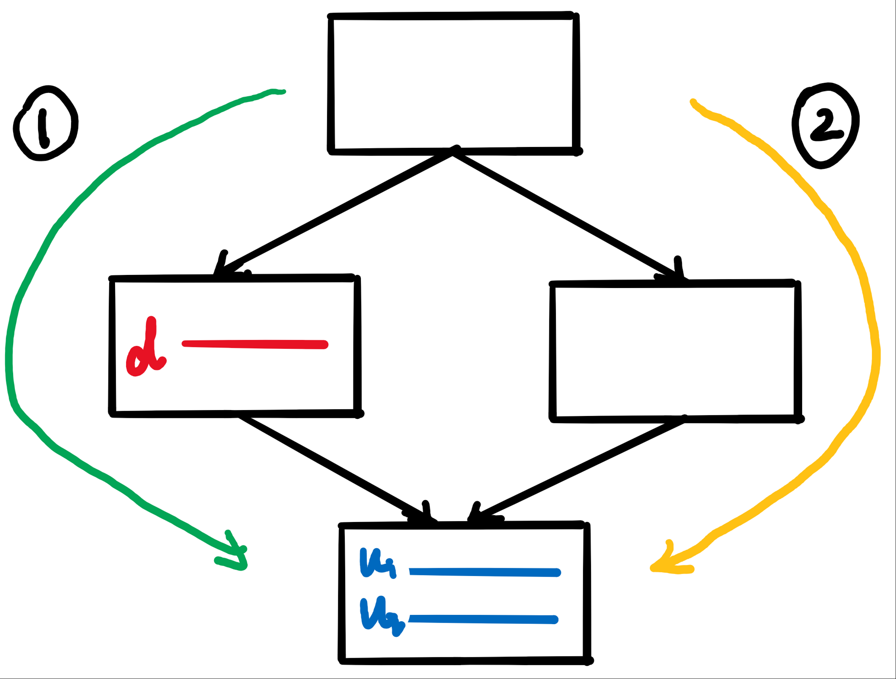
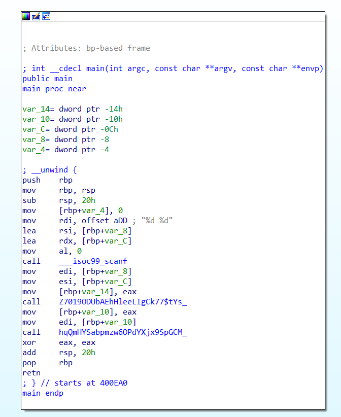
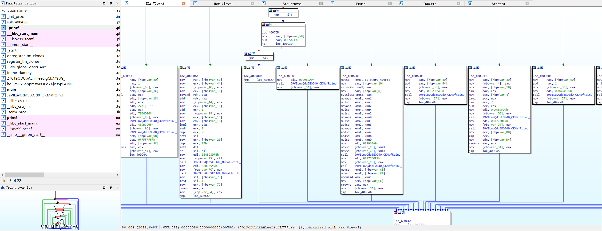

# LLVM_pass_demo

## Pass功能
- BogusControlFlow：强化BCF混淆
- Flattening：强化CFA混淆
- change_func_name：修改非导入函数的函数名
- slice_on_func_param：函数变量前向切片
- dom_ana：收集并打印基本块的支配变量
- split_basic_block：从call指令处将基本块切开

## 计划实现的功能
- [x] 函数名混淆
- [x] 强化BCF：强调隐蔽性，根据支配关系从支配者前驱基本块中搜索或者创建栈变量作为不透明谓词的计算变量
- [x] 强化CFA：使用hash函数返回值的方式保护switch变量的赋值，可以使符号执行失效
- [ ] MBA运算：将线性和多项式MBA应用于混淆
- [ ] 字符串混淆：参考Hikari等项目

## 混淆算法实现细节
### 强化BCF的变量搜索
- 使用数论恒（不）等式作为不透明谓词，需要注意值域是否适合，能否兼容溢出（比如实际发现x(x+1)(x+2)%3 == 0不能很好地作为不透明谓词，因为该算式有可能会溢出，溢出后取模的结果会错误）
- 搜索到的Value要支配使用的块，可以用DominatorTree先计算函数地支配树，再判定选中的Value（指令）和当前基本块的支配关系，例如下图中的d就不能选择，因为它没有支配u1、u2所在的基本块，从路径②出发到该块可以绕过d的定义
- 用DFS搜索，搜索算法类似于图的遍历，要标记遍历过的基本块，否则会无限递归


### 强化CFA
使用hash函数保护switch中的常量，其中f为hash函数
``` C++
while (true)
{
    switch (y)
    {
    case y1:
        y = f(x1); // x1使用随机数生成器生成
        break;
    // ...
    case yi:
        y = f(xi); // xi使用随机数生成器生成
        break;
    default:
        goto out
        break;
    }
}
out:
// ...
```

## 混淆效果
一段非常简单和无聊的代码，作为“CTF题”用来给老弟们赛前壮胆
```c++
#include <stdio.h>

int f = 0x100;

void i2d(int a)
{
    double x = a;
    printf("%lf", x);
}

int calc(int a, int b)
{
    int c,d;
    c = a + b;
    d = c + f;
    int e = 0x1919810;
    int x = a;
    int sum = 0;

    for (size_t i = 0; i < x; i++)
        sum += i;
    
    if (x < 10)
        b = x*x - sum;
    else if (x < 100)
        b = x*2;
    else
        b = x + sum;

    return b;
}

void verify(int x)
{
    if (295207971 == x)
        printf("よくやった CISCN頑張がんばる!\n");
    else
        printf("お前は甘いね~\n");
}

int main()
{
    int a, b;
    scanf("%d %d", &a, &b);
    int x = calc(a, b);
    verify(x);
    return 0;
}
```

混淆参数配置
- 强化BCF
- 强化CFA
- 函数名混淆

只混淆一趟，混淆以后效果如下所示，据说混淆以后还是要花一些时间分析变量的





